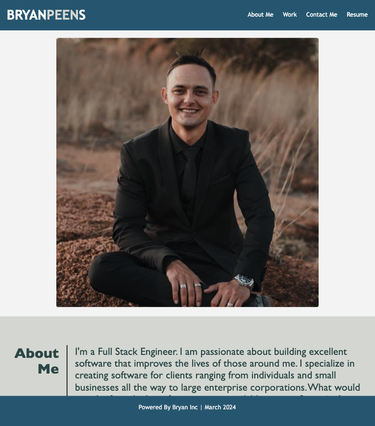

# Bryan Portfolio Website

## Description
This repository contains my developer portfolio website.
It is built with vanilla HTML and CSS.

## Screenshot

## Links
* Link to live [portfolio](https://bryanpeens.github.io/bryan-portfolio-website/)
* Link to github [repo](https://github.com/BryanPeens/bryan-portfolio-website)

## Installation
N/A

## Credits
Bryan Peens

## License
Please refer to the LICENSE in the repo.
